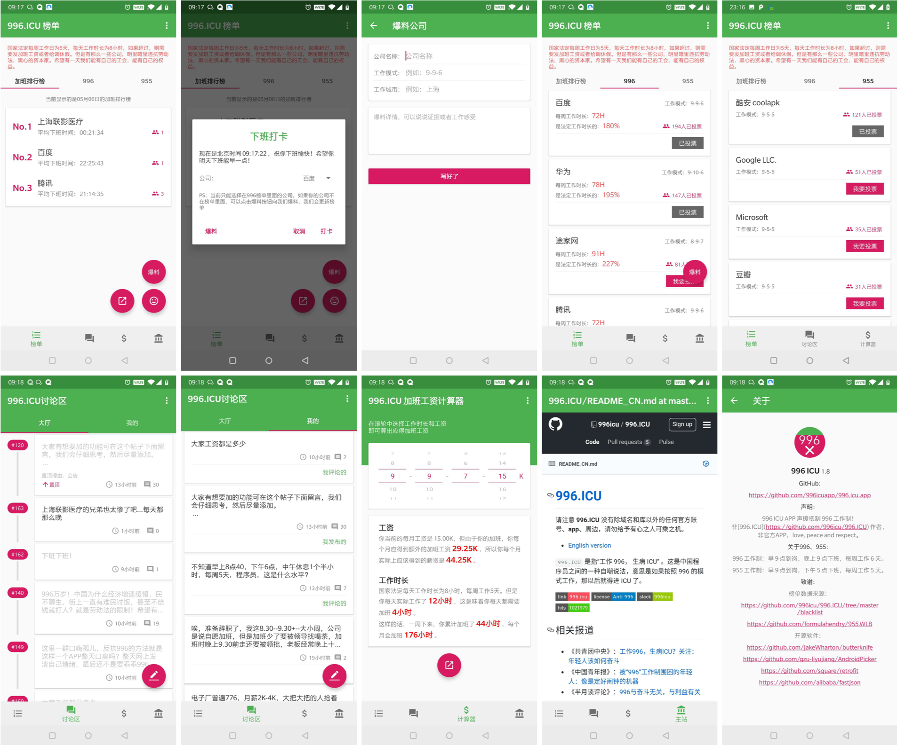

# 996.icu.app

**996 ICU APP 声援抵制 996 工作制， 非 [996.ICU](https://github.com/996icu/996.ICU) 作者，非官方APP，love, peace and respect。**

996.ICU app 提供最新的996黑名单和955白名单、匿名讨论区、加班工资计算器

996 工作制：即每天早 9 点到岗，一直工作到晚上 9 点。每周工作 6 天。

955 工作制：即每天早 9 点到岗，一直工作到下午 5 点。每周工作 5 天。

## 下载
下载地址：

- 地址1：[酷安商店](https://www.coolapk.com/apk/com.youngpower.a996icu)

- 地址2：[GitHub Release](https://github.com/996icuapp/996.icu.app/releases/download/1.0/app-release.apk)

## Screenshots

- 996、955榜单
- 讨论区
- 加班工资计算器

License
---

[反 996 许可证](LICENSE)

 - 此许可证的目的是阻止违反劳动法的公司使用许可证下的软件或代码，并强迫这些公司权衡他们的行为。
